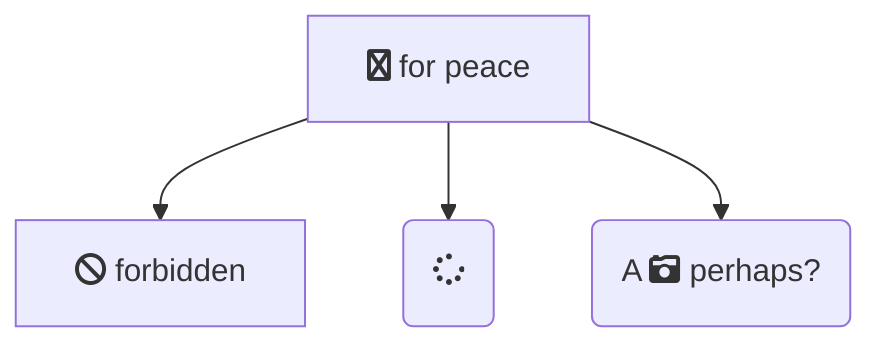

# go-lb-container
A go app that can  return the host name and all header information

```mermaid
graph TD
    B["fa:fa-twitter for peace"]
    B-->C[fa:fa-ban forbidden]
    B-->D(fa:fa-spinner);
    B-->E(A fa:fa-camera-retro perhaps?);
```
